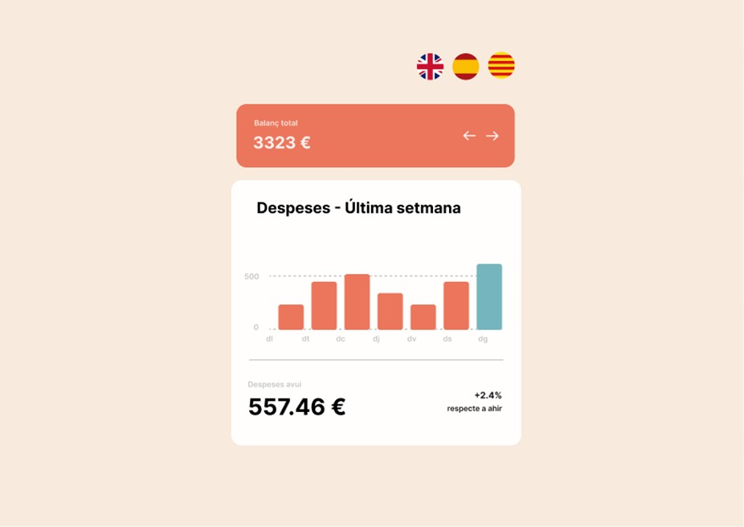

# Sprint de Desenvolupament Frontend

## Objectiu del Sprint
L'objectiu d'aquest sprint serà aprendre a utilitzar llibreries de l'ecosistema frontend per ajudar-nos en la nostra tasca de crear interfícies per a l'usuari/ària.

## Importància d'Integrar Llibreries de Tercers

La capacitat de buscar i integrar llibreries de tercers en projectes és de summa importància per als desenvolupadors frontend. Aquí hi ha diverses raons per les quals aquesta habilitat és tan crucial:

- **Eficiència i Velocitat**: Les llibreries de tercers sovint proporcionen solucions ja fetes a problemes comuns. En fer servir aquestes solucions, un desenvolupador pot evitar la necessitat de “reinventar la roda”, estalviant temps i esforç valuosos. Això pot accelerar significativament el temps de desenvolupament.
- **Qualitat i Fiabilitat**: Les llibreries de tercers solen ser desenvolupades i mantingudes per equips d'experts, i són provades i usades per una àmplia comunitat de desenvolupadors. Això significa que sovint són més fiables i robustes que les solucions casolanes. També solen tenir documentació detallada i una comunitat de suport activa, la qual pot ser molt útil quan es troben problemes.
- **Funcionalitats Avançades**: Les llibreries sovint proporcionen funcionalitats que podrien ser extremadament difícils, o fins i tot impossibles, d'implementar per un mateix. Per exemple, les llibreries per a la creació de gràfics o animacions poden proporcionar capacitats molt sofisticades amb només unes poques línies de codi.

## Exercicis del Sprint

Veuràs que els exercicis són molt oberts. Estan orientats a complir objectius en cada exercici, sense entrar en detall del procés. En aquest punt de l'especialització, has de continuar treballant de forma autònoma resolent exercicis amb molta incertesa.

### Nivell 1

#### Exercici 1
1. Crea la base del projecte amb els components de React necessaris per implementar la interfície.
2. Defineix en Redux o Context les dades que seran utilitzats per la nostra aplicació.
3. Implementa en Redux o Context la lògica per a servir les dades als diferents components:
   - Servir el balanç de despeses.
   - La despesa d'avui.
   - El % de variació entre ahir i avui.
   - Les dades de la gràfica.

**Important**: en tots els components de l'aplicació hauràs d'implementar tests unitaris (recomanable usar Vitest, React Testing Library i Mock Service Worker).

#### Exercici 2
Mostra el balanç total de despeses de la setmana. Cada funcionalitat que realitzis ha d'anar acompanyada del seu test en Jest.

#### Exercici 3
Utilitza `charts.js`, `ApexCharts` o la llibreria de la teva preferència per mostrar a l'usuari la gràfica de les despeses setmanals.

No és necessari fer la gràfica exactament com mostra el disseny, encara que sí que és recomanable dur a terme modificacions d'estil, tenint en compte la documentació de la llibreria de la gràfica, perquè s'assembli en la mesura del possible.

Cada funcionalitat que facis ha d'anar acompanyada del seu test en Jest.

#### Exercici 4
Mostra les despeses totals d'avui i el % de variació respecte a ahir. Cada funcionalitat que facis ha d'anar acompanyada del seu test en Jest.

#### Exercici 5
Implementa el multilingüisme. En modificar-se el selector de la part superior, l'idioma de tots els textos ha de canviar immediatament a l'idioma seleccionat. S'ha d'utilitzar la llibreria `i18n` per a tal propòsit. Cada funcionalitat que realitzis ha d'anar acompanyada del seu test en Jest.

#### Exercici 6
Puja a Vercel el projecte i garanteix que els pipelines de GitHub funcionen correctament, podent fer-se el build correctament.

### Nivell 2

#### Exercici 7
Permet a l'usuari/ària modificar la setmana per a la qual es mostren les dades. Per això, utilitzarà les fletxes esquerra i dreta ubicades al costat del balanç total.

Si estem en la setmana actual, no deixar modificar la setmana. Recorda que hauràs d'ampliar el set de dades per poder permetre recórrer dades més antigues a la setmana actual.

### Nivell 3

#### Exercici 8
Implementa `SonarCloud` en el pipeline de GitHub per dur a terme auditories de codi automatitzades i garantir la qualitat d'aquest.

